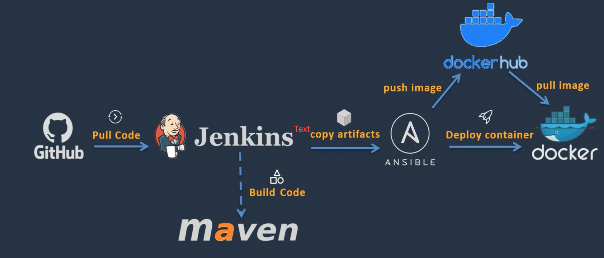

## DevOps Project   - CI/CD with Jenkins Ansible Docker

### Project Overview
### The goal of this project is to deploy a Java-based application in a automated manner. Here are the key components and tools used:

* Jenkins for Continuous Integration and Continuous Deployment (CI/CD)
* Docker for containerizing the application
* Ansible for configuration management

 

