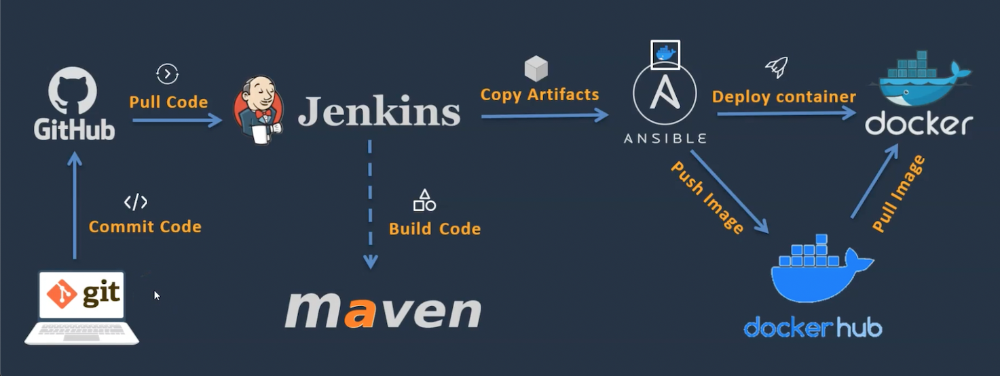

## DevOps Project   - CI/CD with Jenkins Ansible Docker

### Project Overview
### The goal of this project is to deploy a Java-based application in a automated manner. Here are the key components and tools used:

* GitHub - code repository where the project is hosted
* Jenkins for Continuous Integration and Continuous Deployment (CI/CD)
* Maven for building and compiling the Java application
* Docker for containerizing the application
* Ansible for configuration management

 

### Prerequisites

- **Java** 
- **Maven** 

### Steps:

1. Install and configure Jenkins

